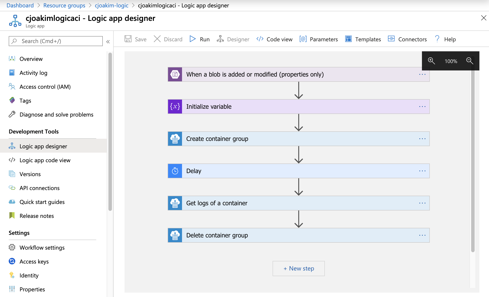
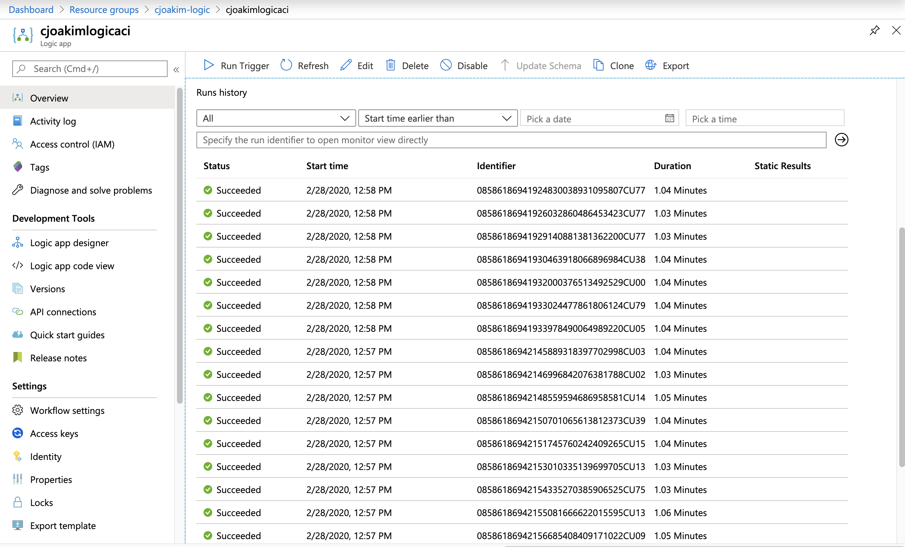

# azure-logicapp-blob-aci-dotnet

Azure Logic App triggered by Azure Storage Blobs, executing an ACI container with DotNet Core code.

## The Application

- Running race CSV rows for individual runners are uploaded to an Azure Storage **source** container
- An **Azure Logic App** is triggered for each of these new Storage blobs
- The Logic App does the following:
  - Gets the Triggering information (see sample JSON below), and passes it to a new **Azure Container Instance**
  - The **Azure Container Instance** then:
    - Reads the Triggering CSV blob
    - Parses the CSV, performs pace and speed calculations with the M26 library
    - Stores the resulting calculation as JSON in a **target** Storage container
    - Deletes the triggering blob from the **source** Storage container
  - Deletes the Azure Container Instance after a delay

### CSV Data

#### Source

https://ashevillemarathon.com/wp-content/uploads/2019/03/marathonoverall.htm

#### Sample

```
place,overall_place,name,city_st,bib,age,10K_rank,10K_time,bridge1_rank,bridge1_time,23m_rank,23m_time,finish_rank,finish_time,chip_time,gun_time
1|1|Ashley Carreon|Oklahoma City OK|360|30|1|40:23.5|1|1:06:46.9|1|2:29:51.9|1|2:52:32.3|2:52:32.3|2:52:32.3
1|2|Nathan Stewart|Cincinnati OH|1010|36|1|41:23.2|2|1:08:28.5|1|2:31:58.2|1|2:53:55.8|2:53:55.8|2:53:55.8
2|3|Daniel Matena|Charlotte NC|1323|35|4|41:41.3|4|1:09:11.0|2|2:33:55.2|2|2:54:33.5|2:54:33.5|2:54:33.5

```

---

## DotNet Core Project Creation

### Bootstrap the DotNet Core Project

```
$ dotnet --version
3.1.101
$ dotnet new console -o blobs
$ cd blobs
$ dotnet add package Microsoft.Azure.Storage.Blob
$ dotnet add package Joakimsoftware.M26 --version 1.0.0
$ dotnet build
$ dotnet run
Hello World!
```

See Program.cs and the other C# files in this repo for the implemented
and working code.

---

## Azure Logic

### Azure Logic App Designer View



### Sample Blob Trigger JSON

The JSON triggerBody() looks like this:

```
{
  "Id": "JTJmc2ltdWxhdGlvbnMlMmZzdGFuX29ycl8xNTgyNzU4NjM2LmNzdg==",
  "Name": "stan_orr_1582758636.csv",
  "DisplayName": "stan_orr_1582758636.csv",
  "Path": "/simulations/stan_orr_1582758636.csv",
  "LastModified": "2020-02-26T23:10:36Z",
  "Size": 96,
  "MediaType": "text/csv",
  "IsFolder": false,
  "ETag": "\"0x8D7BB11167352C9\"",
  "FileLocator": "JTJmc2ltdWxhdGlvbnMlMmZzdGFuX29ycl8xNTgyNzU4NjM2LmNzdg==",
  "LastModifiedBy": null
}
```

### Azure Logic App Code View 

Note the use of **@triggerBody()**, and the **runid** variable derived
from **workflow().run.name**.

```
{
    "definition": {
        "$schema": "https://schema.management.azure.com/providers/Microsoft.Logic/schemas/2016-06-01/workflowdefinition.json#",
        "actions": {
            "Create_container_group": {
                "inputs": {
                    "body": {
                        "location": "@{string('eastus')}",
                        "properties": {
                            "containers": [
                                {
                                    "name": "@{string(variables('runid'))}",
                                    "properties": {
                                        "environmentVariables": [
                                            {
                                                "name": "SOURCE_BLOB_NAME",
                                                "value": "@triggerBody()['Name']"
                                            },
                                            {
                                                "name": "SOURCE_BLOB_PATH",
                                                "value": "@triggerBody()['Path']"
                                            },
                                            {
                                                "name": "AZURE_STORAGE_CONNECTION_STRING",
                                                "value": "your-connection-string"
                                            },
                                            {
                                                "name": "RUNTYPE",
                                                "value": "logic_app_process_blob"
                                            },
                                            {
                                                "name": "TARGET_BLOB_CONTAINER",
                                                "value": "processed"
                                            }
                                        ],
                                        "image": "cjoakim/azure-blobs-core:latest",
                                        "resources": {
                                            "limits": {
                                                "cpu": 1,
                                                "memoryInGB": 2
                                            },
                                            "requests": {
                                                "cpu": 1,
                                                "memoryInGB": 2
                                            }
                                        }
                                    }
                                }
                            ],
                            "osType": "Linux",
                            "restartPolicy": "Never"
                        }
                    },
                    "host": {
                        "connection": {
                            "name": "@parameters('$connections')['aci']['connectionId']"
                        }
                    },
                    "method": "put",
                    "path": "/subscriptions/@{encodeURIComponent('your-subscription-id')}/resourceGroups/@{encodeURIComponent('cjoakim-logic')}/providers/Microsoft.ContainerInstance/containerGroups/@{encodeURIComponent(variables('runid'))}",
                    "queries": {
                        "x-ms-api-version": "2017-10-01-preview"
                    }
                },
                "runAfter": {
                    "Initialize_variable": [
                        "Succeeded"
                    ]
                },
                "type": "ApiConnection"
            },
            "Delay": {
                "inputs": {
                    "interval": {
                        "count": 1,
                        "unit": "Minute"
                    }
                },
                "runAfter": {
                    "Create_container_group": [
                        "Succeeded"
                    ]
                },
                "type": "Wait"
            },
            "Delete_container_group": {
                "inputs": {
                    "host": {
                        "connection": {
                            "name": "@parameters('$connections')['aci']['connectionId']"
                        }
                    },
                    "method": "delete",
                    "path": "/subscriptions/@{encodeURIComponent('your-subscription-id')}/resourceGroups/@{encodeURIComponent('cjoakim-logic')}/providers/Microsoft.ContainerInstance/containerGroups/@{encodeURIComponent(variables('runid'))}",
                    "queries": {
                        "x-ms-api-version": "2017-10-01-preview"
                    }
                },
                "runAfter": {
                    "Get_logs_of_a_container": [
                        "Succeeded"
                    ]
                },
                "type": "ApiConnection"
            },
            "Get_logs_of_a_container": {
                "inputs": {
                    "host": {
                        "connection": {
                            "name": "@parameters('$connections')['aci']['connectionId']"
                        }
                    },
                    "method": "get",
                    "path": "/subscriptions/@{encodeURIComponent('your-subscription-id')}/resourceGroups/@{encodeURIComponent('cjoakim-logic')}/providers/Microsoft.ContainerInstance/containerGroups/@{encodeURIComponent(variables('runid'))}/containers/@{encodeURIComponent(string(variables('runid')))}/logs",
                    "queries": {
                        "x-ms-api-version": "2017-10-01-preview"
                    }
                },
                "runAfter": {
                    "Delay": [
                        "Succeeded"
                    ]
                },
                "type": "ApiConnection"
            },
            "Initialize_variable": {
                "inputs": {
                    "variables": [
                        {
                            "name": "runid",
                            "type": "string",
                            "value": "@{toLower(concat('c-', workflow().run.name))}"
                        }
                    ]
                },
                "runAfter": {},
                "type": "InitializeVariable"
            }
        },
        "contentVersion": "1.0.0.0",
        "outputs": {},
        "parameters": {
            "$connections": {
                "defaultValue": {},
                "type": "Object"
            }
        },
        "triggers": {
            "When_a_blob_is_added_or_modified_(properties_only)": {
                "inputs": {
                    "host": {
                        "connection": {
                            "name": "@parameters('$connections')['azureblob']['connectionId']"
                        }
                    },
                    "method": "get",
                    "path": "/datasets/default/triggers/batch/onupdatedfile",
                    "queries": {
                        "folderId": "JTJmc2ltdWxhdGlvbnM=",
                        "maxFileCount": 1
                    }
                },
                "metadata": {
                    "JTJmc2ltdWxhdGlvbnM=": "/simulations"
                },
                "recurrence": {
                    "frequency": "Minute",
                    "interval": 1
                },
                "splitOn": "@triggerBody()",
                "type": "ApiConnection"
            }
        }
    },
    "parameters": {
        "$connections": {
            "value": {
                "aci": {
                    "connectionId": "/subscriptions/your-subscription-id/resourceGroups/cjoakim-logic/providers/Microsoft.Web/connections/aci",
                    "connectionName": "aci",
                    "id": "/subscriptions/your-subscription-id/providers/Microsoft.Web/locations/eastus/managedApis/aci"
                },
                "azureblob": {
                    "connectionId": "/subscriptions/your-subscription-id/resourceGroups/cjoakim-logic/providers/Microsoft.Web/connections/azureblob",
                    "connectionName": "azureblob",
                    "id": "/subscriptions/your-subscription-id/providers/Microsoft.Web/locations/eastus/managedApis/azureblob"
                }
            }
        }
    }
}
```

---

## Testing the Container

Compile and containerize the DotNet Core code:
```
$ ./containerize.sh 
```

Use **Docker Compose** to simulate the execution of the ACI in the Logic App by
passing it environment variables.  See file **docker-compose.yml**.
```
$ /.compose.sh up
```

Once testing is completed, upload the contaner to your **Azure Container Registry (ACR)**.
Note, this sample project uses **DockerHub** instead of ACR, so that others can
easily recreate this project in their own Azure subscriptions.

---

## System Testing

A complete system test includes:

- Execute **./delete_blobs.sh** to delete any remnant source/simulation blobs
- Execute **./download_blobs.sh** to delete any remnant target/calculated blobs
- Remove the files in the **tmp/** directory
- Execute **./populate_blobs.sh** to upload randomized source/simulation blobs
- Observe the state of the two blob containers with **Azure Storage Explorer**
- Observe the **Run History** (image below) of the Logic App in Azure Portal
- Execute **./download_blobs.sh** to download the new target/calculated blobs



---

## Links

- https://docs.microsoft.com/en-us/azure/storage/blobs/storage-quickstart-blobs-dotnet
- https://www.klaine.net/example-azure-container-instances-with-logic-apps/
- https://www.nuget.org/packages/Joakimsoftware.M26/
- https://github.com/cjoakim/m26-cs
- https://docs.microsoft.com/en-us/dotnet/api/azure.storage.blobs?view=azure-dotnet

### Pricing

- https://azure.microsoft.com/en-us/pricing/details/logic-apps/
- https://azure.microsoft.com/en-us/pricing/details/container-instances/
- https://azure.microsoft.com/en-us/pricing/details/storage/blobs/
