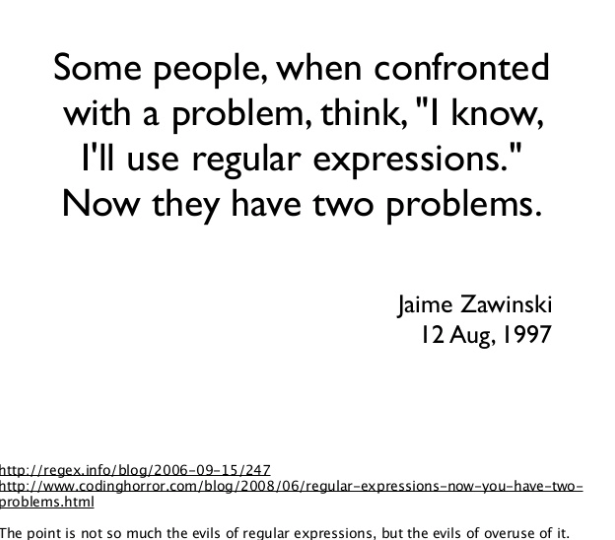

# regular expressions




## Examples

```
/^([a-z0-9_\.-]+)@([\da-z\.-]+)\.([a-z\.]{2,6})$/
```

Match a URL in Python:
```
http[s]?://(?:[a-zA-Z]|[0-9]|[$-_@.&+]|[!*\(\),]|(?:%[0-9a-fA-F][0-9a-fA-F]))+
```

Match a URL in PHP:
```
%^(?:(?:https?|ftp)://)(?:\S+(?::\S*)?@|\d{1,3}(?:\.\d{1,3}){3}|(?:(?:[a-z\d\x{00a1}-\x{ffff}]+-?)*[a-z\d\x{00a1}-\x{ffff}]+)(?:\.(?:[a-z\d\x{00a1}-\x{ffff}]+-?)*[a-z\d\x{00a1}-\x{ffff}]+)*(?:\.[a-z\x{00a1}-\x{ffff}]{2,6}))(?::\d+)?(?:[^\s]*)?$%iu
```


## Links

https://medium.com/@jenniferolibie/heres-what-you-need-to-know-about-regular-expressions-ac5f1148effa

